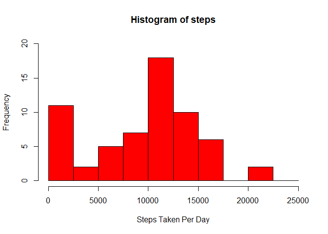
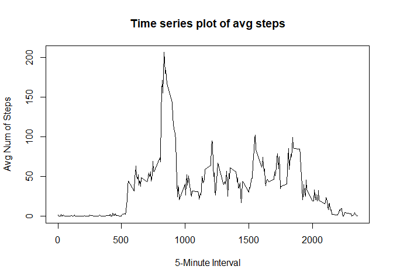
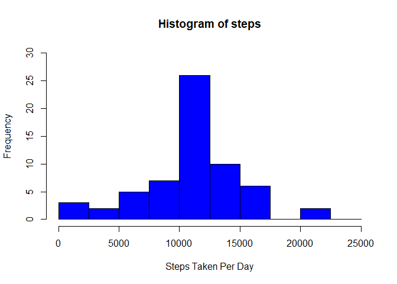
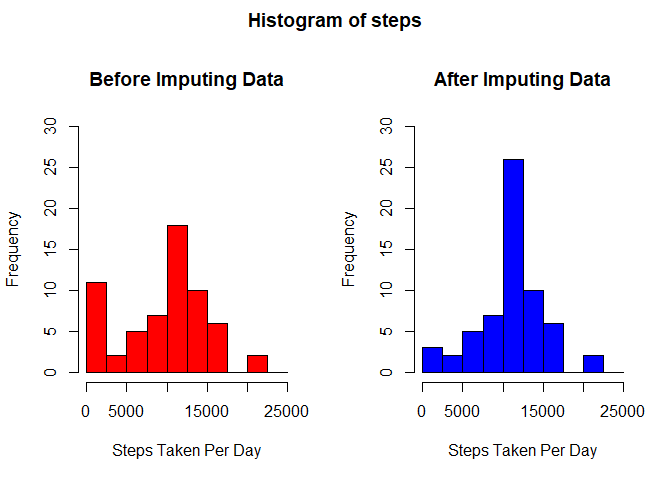
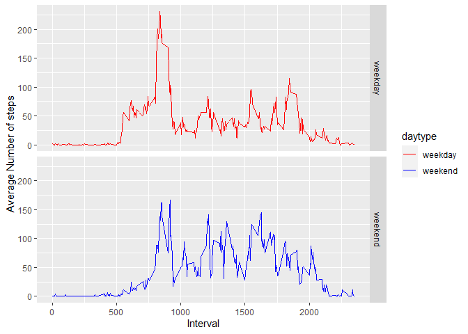

## Reproducible Research Course Project 1

This is an HTML file created from a R Markdown file using the knitr library.
It shows the results of the analysis performed by me.
Please take a look at it and comment what you think.

### 1.) Loading and preprocessing the data


```r
library(dplyr)
url<-"https://d396qusza40orc.cloudfront.net/repdata%2Fdata%2Factivity.zip"
#download.file(url,"Data.zip")
#unzip("Data.zip")

data<-read.csv("activity.csv")

data$date<-as.Date(as.character(data$date), format="%Y-%m-%d")
head(data)
```

```
##   steps       date interval
## 1    NA 2012-10-01        0
## 2    NA 2012-10-01        5
## 3    NA 2012-10-01       10
## 4    NA 2012-10-01       15
## 5    NA 2012-10-01       20
## 6    NA 2012-10-01       25
```


### 2.) What is mean total number of steps taken per day?

#### Lets first calculate the total number of steps per day

```r
data2<-group_by(data,date)
#Total number of steps per day :-
data21<-summarise(data2,steps=sum(steps,na.rm = T))
head(data21)
```

```
## # A tibble: 6 x 2
##   date       steps
##   <date>     <int>
## 1 2012-10-01     0
## 2 2012-10-02   126
## 3 2012-10-03 11352
## 4 2012-10-04 12116
## 5 2012-10-05 13294
## 6 2012-10-06 15420
```

#### Now lets make a histogram for the calculated sum above

```r
#Histogram for the total num of steps per day :-
hist(data21$steps,main="Histogram of steps",xlab = "Steps Taken Per Day",col = "Red",
     ylim = c(0,20), breaks = seq(0,25000, by=2500))
```

<!-- -->

#### The Mean and Median and other details of the total number of steps taken per day for the above 

```r
summary(data21$steps)
```

```
##    Min. 1st Qu.  Median    Mean 3rd Qu.    Max. 
##       0    6778   10395    9354   12811   21194
```

```r
mean<-summary(data21$steps)[4]
median<-summary(data21$steps)[3]
```

So the mean is 9354.2295082 and the median is 1.0395\times 10^{4} .

### 3.) What is the average daily activity pattern

#### Lets first calculate the mean of the number of steps taken

```r
data3<-group_by(data,interval)
data31<-summarise(data3,means=mean(steps,na.rm = T))
head(data31)
```

```
## # A tibble: 6 x 2
##   interval  means
##      <int>  <dbl>
## 1        0 1.72  
## 2        5 0.340 
## 3       10 0.132 
## 4       15 0.151 
## 5       20 0.0755
## 6       25 2.09
```

#### Lets Make a time series plot 

```r
with(data31,plot(interval,means,type = "l",ylab = "Avg Num of Steps",xlab = "5-Minute Interval"))
title(main="Time series plot of avg steps")
```

<!-- -->

#### Which 5-minute interval, on average across all the days, contains the maximum number of steps

```r
filter(data31,data31$means==max(data31$means))$interval
```

```
## [1] 835
```


### 4.) Imputing missing values

#### Calculate and report the total number of missing values in the dataset 

```r
steps_na<-sapply(data$steps,is.na)
sum(steps_na)
```

```
## [1] 2304
```

#### Devise a strategy for filling in all of the missing values in the dataset

```r
#I will replace with means of 5-minute intervals
to_replace<-match(data$interval,data31$interval)
means<-data31$means[to_replace]
```

#### Create a new dataset that is equal to the original dataset but with the missing data filled in.

```r
#New dataset
data4<-mutate(data, steps = ifelse(steps_na, yes = means, no = data$steps))
head(data4)
```

```
##       steps       date interval
## 1 1.7169811 2012-10-01        0
## 2 0.3396226 2012-10-01        5
## 3 0.1320755 2012-10-01       10
## 4 0.1509434 2012-10-01       15
## 5 0.0754717 2012-10-01       20
## 6 2.0943396 2012-10-01       25
```

#### Make a histogram of the total number of steps taken each day

```r
# First i calculate the sum of steps taken per day of the new dataset 
data41<-group_by(data4,date)
data42<-summarise(data41,steps=sum(steps,na.rm = T))

# now i plot the histogram
hist(data42$steps,main="Histogram of steps",xlab = "Steps Taken Per Day",col = "Blue",
     ylim = c(0,30), breaks = seq(0,25000, by=2500))
```

<!-- -->

#### Claculating mean and median total number of steps taken per day

```r
summary(data42$steps)
```

```
##    Min. 1st Qu.  Median    Mean 3rd Qu.    Max. 
##      41    9819   10766   10766   12811   21194
```

```r
new_mean<-summary(data42$steps)[4]
new_median<-summary(data42$steps)[3]
```

So the mean is 1.0766189\times 10^{4} and the median is 1.0766189\times 10^{4} .

#### Impact of imputing missing data on the estimates of the total daily number of steps

Imputing missing data have only a little and transcurable impact on the mean ant the median of the total daily number of steps. Watching the histogram we can note than the only bin that is changed is the interval between 10000 and 12500 steps, grown from a frequency of 18 to a frequency of 26. Different methods for replace missing values could cause different results.
Lets take a look at this difference by plotting their histograms.


```r
par(mfrow=c(1,2),oma=c(0,0,2,0))
hist(data21$steps,main="Before Imputing Data",xlab = "Steps Taken Per Day",col = "Red",
     ylim = c(0,30), breaks = seq(0,25000, by=2500))
hist(data42$steps,main="After Imputing Data",xlab = "Steps Taken Per Day",col = "Blue",
     ylim = c(0,30), breaks = seq(0,25000, by=2500))
title("Histogram of steps", outer = TRUE)
```

<!-- -->

```r
par(mfrow=c(1,1),oma=c(0,0,0,0))
```


### 5.) Are there differences in activity patterns between weekdays and weekends?

#### Create a new factor variable in the dataset with two levels – “weekday” and “weekend”


```r
#Finding the days of the given dates
weekday<-weekdays(data4$date)
#converting them to "weekday" and "weekend" using logic comparison
weekday<-ifelse(weekday=="Saturday"|weekday=="Sunday",yes="weekend",no="weekday")
#creating a factor variable
weekday<-as.factor(weekday)
#adding this new factor variable to the previous imputed dataset
data4<-mutate(data4,daytype=weekday)
head(data4)
```

```
##       steps       date interval daytype
## 1 1.7169811 2012-10-01        0 weekday
## 2 0.3396226 2012-10-01        5 weekday
## 3 0.1320755 2012-10-01       10 weekday
## 4 0.1509434 2012-10-01       15 weekday
## 5 0.0754717 2012-10-01       20 weekday
## 6 2.0943396 2012-10-01       25 weekday
```

#### Make a panel plot containing a time series plot


```r
#Grouping and finding the mean steps taken averaged across per day 
data43<-group_by(data4,interval,daytype)
data44<-summarise(data43,means=mean(steps,na.rm = T))

#using ggplot2 library for the panel plot
library(ggplot2)
g<-ggplot(data44,aes(interval,means,color=daytype)) + geom_line()+ scale_color_manual(values = c("red","blue")) +
    facet_grid(daytype ~ .)+
    xlab("Interval")+ylab("Average Number of steps")
print(g)
```

<!-- -->

